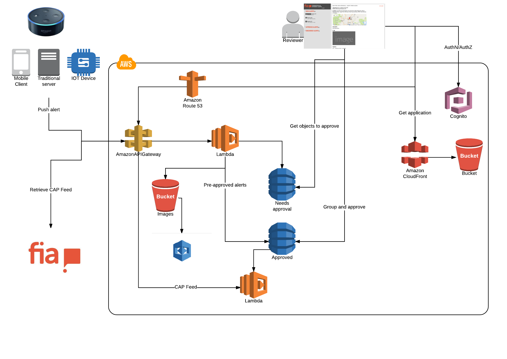

# AWS Reinvent 2017

## Architecture

## Installing

[Backend](serverless/README.md)

[Admin UI](admin-ui/README.md)

[Alexa skill](alexa-skill-lambda/README.md)

[iOS client](ios/FiaAlerts/README.md)

TODO

## Hackaton Team

- [Pasi Niemi](https://www.linkedin.com/in/psiniemi/)  [psiniemi](https://github.com/psiniemi)
- [Michal Lison](https://www.linkedin.com/in/michallison/) [mlison](https://github.com/mlison)
- [Timo Tenhunen](https://www.linkedin.com/in/timotenhunen/) [tenhunet](https://github.com/tenhunet)
- [Björn Heselius](https://www.linkedin.com/in/bjohes/) [bjohes](https://github.com/bjohes)
- [Richard Weber](https://www.linkedin.com/in/richard-weber-880a1a69/) [tebro](https://github.com/tebro)
- [Jukka Miettinen](https://www.linkedin.com/in/jukkamiettinen/) [jukkamiettinen](https://github.com/jukkamiettinen)
- [Antti Turunen](https://www.linkedin.com/in/antti-turunen-24bb861/) [ahturune](https://github.com/ahturune)
- [Juha Syrjälä](https://www.linkedin.com/in/jsyrjala/) [jsyrjala](https://github.com/jsyrjala)
- [Mika Majakorpi](https://www.linkedin.com/in/majakorpi/) [mmajis](https://github.com/mmajis)
- [Sauli Ketola](https://www.linkedin.com/in/sauliketola/) [ketola](https://github.com/ketola)

from [Nitor](https://www.nitor.com)
