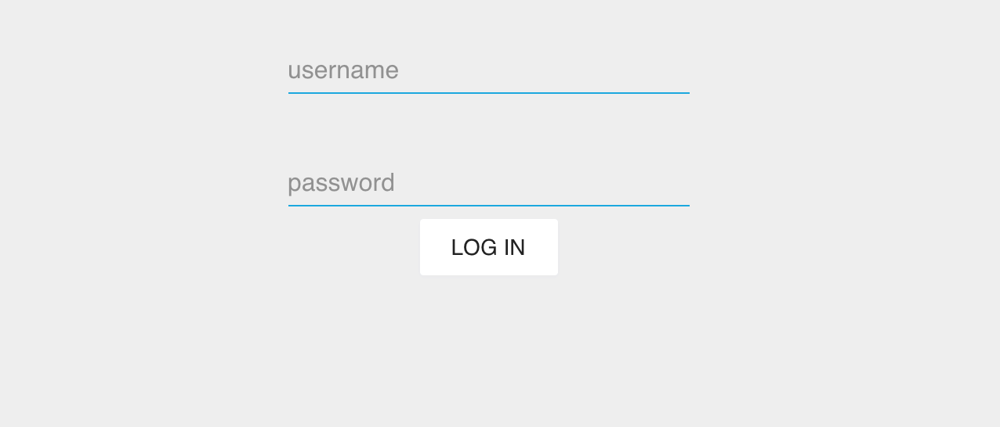
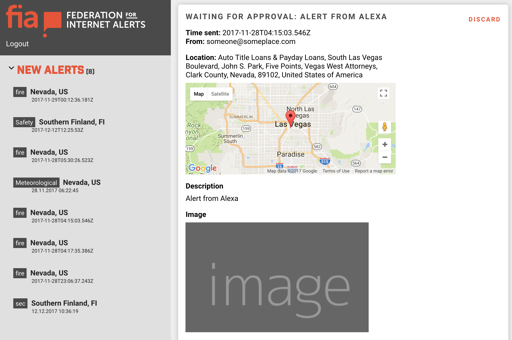
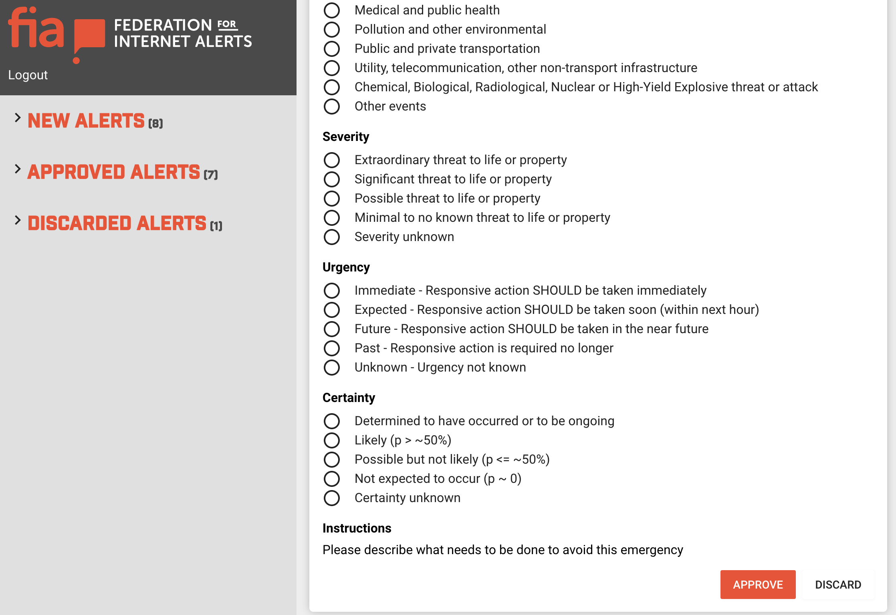

# Admin UI

Admin UI displays incoming alerts, and allows administrators to view and modify, to reject or to accept them. After accepting the alerts will be published to FIA.







## Development

### Install dependencies.
```
yarn
```

### Run local development server

```
yarn start
```

Runs the app in the development mode.<br>
Open [http://localhost:3000](http://localhost:3000) to view it in the browser.

The page will reload if you make edits.<br>
You will also see any lint errors in the console.

### Run automatic tests

```
yarn test
```

Launches the test runner in the interactive watch mode.<br>
See the section about [running tests](#running-tests) for more information.

### Build production package

```
yarn run build
```

Builds the app for production to the `build` folder.<br>
It correctly bundles React in production mode and optimizes the build for the best performance.

## Tools and libraries

- https://github.com/NitorCreations/aws-react-components
- http://www.material-ui.com/
- https://github.com/tomchentw/react-google-maps
