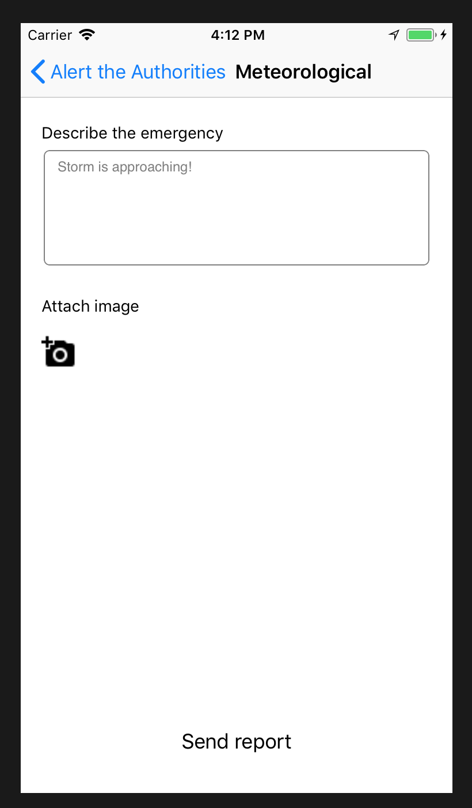

# iOS Client

iOS app supports sending alerts to FIA. User' location is automatically included.




TODO: fix image uploading. 

## Development

### Install dependencies
```
pod install
```

### Configuration
```
in file ReportViewController.swift:
...
let stackUrlCreateAlert = <insert-api-endpoint-url-here>
let stackUrlSendImage = <insert-api-endpoint-url-here>
let identityPool = <insert-identity-pool-id-here>
let awsRegionType: AWSRegionType = <insert-region-here>
...
```

### Deploying

Deploy using Xcode.
